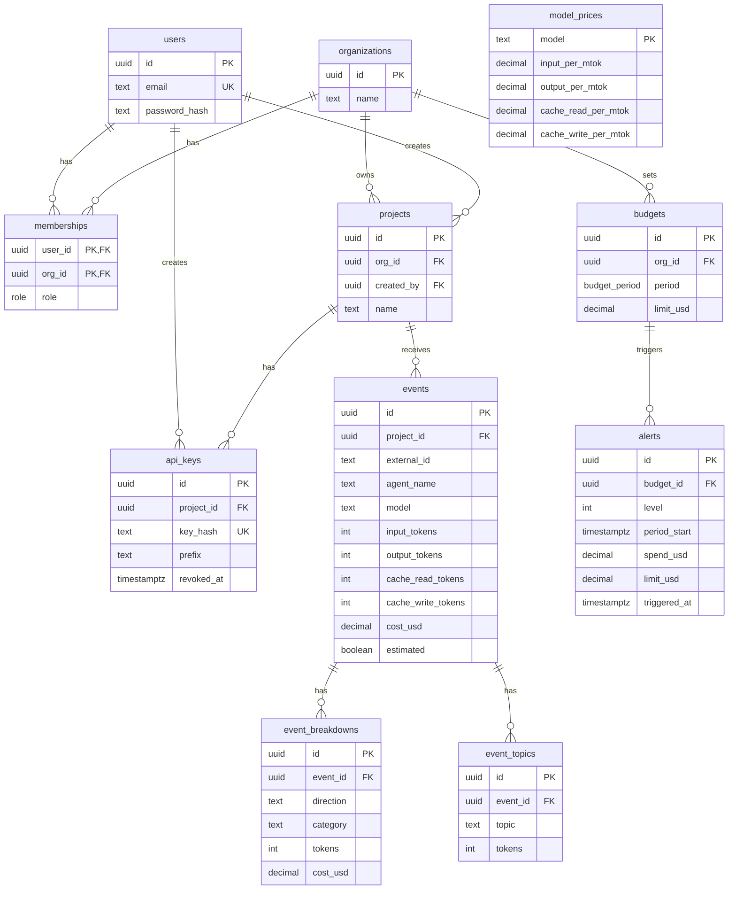

# Database schema

Source of truth: `prisma/schema.prisma`.

```mermaid
erDiagram
    users ||--o{ memberships : has
    organizations ||--o{ memberships : has
    organizations ||--o{ projects : owns
    users ||--o{ projects : creates
    users ||--o{ api_keys : creates
    projects ||--o{ api_keys : has
    projects ||--o{ events : receives
    events ||--o{ event_breakdowns : has
    events ||--o{ event_topics : has
    organizations ||--o{ budgets : sets
    budgets ||--o{ alerts : triggers

    users {
        uuid id PK
        text email UK
        text password_hash
    }
    organizations {
        uuid id PK
        text name
    }
    memberships {
        uuid user_id PK, FK
        uuid org_id PK, FK
        role role
    }
    projects {
        uuid id PK
        uuid org_id FK
        uuid created_by FK
        text name
    }
    api_keys {
        uuid id PK
        uuid project_id FK
        text key_hash UK
        text prefix
        timestamptz revoked_at
    }
    events {
        uuid id PK
        uuid project_id FK
        text external_id
        text agent_name
        text model
        int input_tokens
        int output_tokens
        int cache_read_tokens
        int cache_write_tokens
        decimal cost_usd
        boolean estimated
    }
    event_breakdowns {
        uuid id PK
        uuid event_id FK
        text direction
        text category
        int tokens
        decimal cost_usd
    }
    event_topics {
        uuid id PK
        uuid event_id FK
        text topic
        int tokens
    }
    model_prices {
        text model PK
        decimal input_per_mtok
        decimal output_per_mtok
        decimal cache_read_per_mtok
        decimal cache_write_per_mtok
    }
    budgets {
        uuid id PK
        uuid org_id FK
        budget_period period
        decimal limit_usd
    }
    alerts {
        uuid id PK
        uuid budget_id FK
        int level
        timestamptz period_start
        decimal spend_usd
        decimal limit_usd
        timestamptz triggered_at
    }
```
